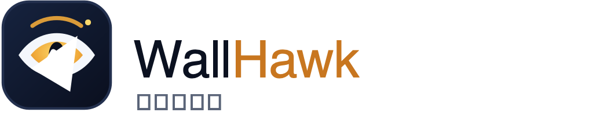

# 美股板块盯盘面板

<p align="center">
  
</p>

单页面展示 **15 个热门美股板块**及成分股，每隔 X 秒自动拉取最新价，**含盘前 / 盘中 / 盘后**，并聚合财经要闻与价格触达提醒，辅助盘中决策。

> [English version](./README_EN.md)

---

## 特性

| 功能 |
|---|
| 15 板块 × ~10 只成分股，一页全览 |
| 自动刷新（5/10/15/30/60 秒可选，默认 10 秒），可暂停 |
| 盘前 / 盘中 / 盘后 自动切换，延展时段显示「盘中当日涨幅」副行 |
| 涨跌颜色闪烁高亮，价格变动瞬间高亮 |
| 顶栏美股整体状态徽章 + 美东时间 |
| 红涨绿跌 / 绿涨红跌 颜色惯例可切（本地记忆） |
| 「按涨幅排」一键排序，快速锁定龙头/落后 |
| 多数据源可切换：新浪 / 腾讯 / Yahoo / 富途 OpenAPI |
| 财经要闻聚合页（快讯 + 深度文章，多源容错） |
| 价格触达提醒：下穿预期价时推送到微信 |
| 代码列点击直达 Yahoo 个股页 |

---

## 快速开始

```bash
cd us_stock_dashboard
chmod +x run.sh
./run.sh
```

浏览器打开 <http://localhost:8050>。

> 默认端口 8050（避开已被 A 股 `stock_monitor` 与 macOS AirPlay 占用的 5000）。
> 依赖：Flask、requests、feedparser。首次运行 `run.sh` 会自动建虚拟环境并安装。

手动启动（不用脚本）：

```bash
python3 -m venv venv && source venv/bin/activate
pip install -r requirements.txt
python app.py
```

---

## 数据源

通过环境变量 `DATA_SOURCE` 控制（默认 `SINA`）。

### 新浪行情 · SINA（默认）

`hq.sinajs.cn`，`gb_`+代码 批量取数。**中国可直连、免登录，含独立盘前/盘后价**，延展时段自动切换显示并以「盘中 X%」副行展示当日常规涨跌。少数新股/退市股/部分 ADR 未收录（如 ZEEKR、NKLA、SQ、IMBBY、KAVL），这些行显示 `--`，可移除或换富途源。

### 腾讯行情 · TENCENT

`qt.gtimg.cn`，`us`+代码 批量。中国直连免登录，但**无独立盘前盘后价、延展时段不更新**，仅作备用。`DATA_SOURCE=TENCENT`。

### Yahoo Finance · YAHOO

零配置、免登录，**含独立盘前/盘后价与 `marketState`**。非官方接口，**部分地区（如中国大陆）被地理屏蔽返回 403**，需在可直连 Yahoo 的网络下使用。后端已做 crumb 自动刷新与重试。`DATA_SOURCE=YAHOO`。

### 富途 OpenAPI · FUTU

官方实时行情。需安装 `futu-api`、启动 OpenD（默认 `127.0.0.1:11111`），再 `export DATA_SOURCE=FUTU`。免费额度行情可能延时 15 分钟。`FUTU_HOST` / `FUTU_PORT` 可覆盖。

---

## 财经要闻

`/news` 页聚合多源财经与地缘要闻，每源独立抓取、独立容错，带 TTL 内存缓存：

- **国内可直连**：华尔街见闻（快讯/深度）、东方财富快讯、36氪（快讯/文章）、IT之家、Cointelegraph、Seeking Alpha
- **境外源（需代理）**：Reuters、CNBC、WSJ、NYT、FT、Bloomberg、Nikkei Asia

境外源在大陆直连通常被墙，仅当设置了 `HTTPS_PROXY`/`HTTP_PROXY` 时才抓取，否则只展示信息源标签（标注「需代理」）。缓存 TTL 由 `NEWS_CACHE_TTL` 控制（默认 180 秒）。

---

## 配置项（环境变量）

| 变量 | 默认 | 说明 |
|---|---|---|
| `DATA_SOURCE` | `SINA` | `SINA` / `TENCENT` / `YAHOO` / `FUTU` |
| `HOST` | `0.0.0.0` | Web 监听地址 |
| `PORT` | `8050` | Web 端口 |
| `DEFAULT_REFRESH_SEC` | `10` | 前端默认刷新间隔 |
| `QUOTE_CACHE_TTL` | `3` | 服务端行情缓存秒数，合并快速轮询 |
| `YAHOO_BATCH_SIZE` | `50` | Yahoo 单次批量请求数 |
| `YAHOO_TIMEOUT` | `10` | Yahoo 请求超时（秒）|
| `FUTU_HOST` / `FUTU_PORT` | `127.0.0.1` / `11111` | OpenD 地址 |
| `ALERT_CHANNEL` | `pushplus` | 提醒通道：`pushplus` / `wecom` / `serverchan` |
| `ALERT_CHECK_INTERVAL` | `10` | 价格提醒检查间隔（秒）|
| `PUSHPLUS_TOKEN` | 空 | PushPlus 通知 token（`ALERT_CHANNEL=pushplus` 时）|
| `WECOM_WEBHOOK` | 空 | 企业微信群机器人 webhook（`ALERT_CHANNEL=wecom` 时）|
| `SERVERCHAN_SENDKEY` | 空 | Server酱 sendkey（`ALERT_CHANNEL=serverchan` 时）|
| `NEWS_CACHE_TTL` | `180` | 要闻缓存秒数 |
| `HTTPS_PROXY` / `HTTP_PROXY` | 空 | 代理，用于点亮境外新闻源 |

---

## API

| 方法 | 路径 | 说明 |
|---|---|---|
| `GET` | `/` | 盯盘页面 |
| `GET` | `/news` | 要闻页面 |
| `GET` | `/api/sectors` | 板块结构 |
| `GET` | `/api/quotes` | 全部标的最新行情 `{symbol: {...}}` |
| `GET` | `/api/news` | 要闻聚合 |
| `POST` | `/api/sectors/<key>/stocks` | 添加股票 `{symbol, name?}` |
| `POST` | `/api/stocks/move` | 跨板块移动 `{symbol, from, to}` |
| `DELETE` | `/api/sectors/<key>/stocks/<symbol>` | 移除股票 |
| `POST` | `/api/watch/<symbol>` | 加入「今日关注」|
| `DELETE` | `/api/watch/<symbol>` | 移出「今日关注」|
| `POST` | `/api/watch/<symbol>/expect` | 保存预期价 `{price}` |
| `POST` | `/api/reset` | 恢复默认板块 |
| `GET` | `/api/health` | 数据源与缓存状态 |

每个 quote 字段：`price`(活跃时段价) `prev_close` `change` `change_pct` `regular_price` `regular_change_pct` `pre_price` `pre_change_pct` `post_price` `post_change_pct` `market_state`(PRE/REGULAR/POST/CLOSED/PREPRE) `currency` `last_updated` `source`。

---

## 价格触达提醒

对「今日关注」板块中设置了**预期价**的股票，当最新价从预期价**上方下穿**到预期价（≤）时，自动推送一条微信通知。

### 使用步骤

1. **配置通知通道（选其一）**：

   - PushPlus（默认，实名免费 200 条/天）: `export PUSHPLUS_TOKEN="你的token"`
   - 企业微信群机器人: `export ALERT_CHANNEL=wecom && export WECOM_WEBHOOK="https://qyapi.weixin.qq.com/cgi-bin/webhook/send?key=xxx"`
   - Server酱（免费 5 条/天）: `export ALERT_CHANNEL=serverchan && export SERVERCHAN_SENDKEY="你的sendkey"`

2. **在页面填预期价**：打开面板 → 「今日关注」板块 → 点行首 ⭐ → 「预期价」输入框填目标价（失焦自动保存）。

3. **启动并保持运行**：`./run.sh`，后台每 10 秒检查一次。

### 触发规则（边沿触发）

- 只在价格从上方**下穿**预期价的瞬间提醒**一次**，之后持续低于不重复。
- 价格回升到上方、再次下穿时再次提醒。
- 修改预期价会重置追踪。
- 启动时已低于预期价不提醒（无下穿边沿）。

> 提醒运行在 Flask 后台线程，**面板进程必须保持运行**；状态持久化到 `alert_state.json`，重启不重复。

---

## 自定义板块/个股（页内编辑）

页面支持直接增删与移动，改动持久化到 `watchlist.json`（重启/换浏览器不丢）。该文件已被 `.gitignore` 忽略；**首次运行或点「恢复默认」时，会从 `sectors.py` 自动生成默认板块**，因此 fork 后不会泄露个人自选股。

- **添加**: 卡片底部输入框填代码（名称留空自动抓取），点 `＋`。
- **移动**: 拖拽个股行到目标板块卡片。
- **移除**: 悬停个股行，点右侧 `✕`。
- **恢复默认**: 顶栏 `恢复默认` 一键还原 `sectors.py` 中的初始板块与个股。

---

## 文件结构

```
us_stock_dashboard/
├── sectors.py              # 15 板块成分股数据（默认种子）
├── config.py               # 配置（环境变量）
├── datasource.py           # 数据源抽象：SINA / TENCENT / YAHOO / FUTU
├── news.py                 # 财经要闻聚合
├── app.py                  # Flask 后端
├── price_alert.py          # 价格触达提醒
├── utils/weichat_notify.py # 微信通知（pushplus/wecom/serverchan）
├── templates/index.html    # 单页盯盘界面
├── templates/news.html     # 要闻界面
├── requirements.txt
├── run.sh / run.bat
├── LICENSE                 # MIT 协议
├── README.md
└── README_EN.md
```

> `watchlist.json` / `alert_state.json` 为运行时生成文件，不入库。

---

## 注意

- 行情与新闻仅供决策参考，**非交易建议**。
- Yahoo 非官方接口可能因风控临时失效；富途需登录与 OpenD 在线。两者任一不可用时页面会显示异常提示并保留最近缓存。
- 板块热门度排序参考富途美股框架，近似值，会随市场轮动变化。

---

## 协议

[MIT License](./LICENSE) © 2026

在发布你的 fork 前，请将 `LICENSE` 文件中的版权持有人替换为你自己的名称。
