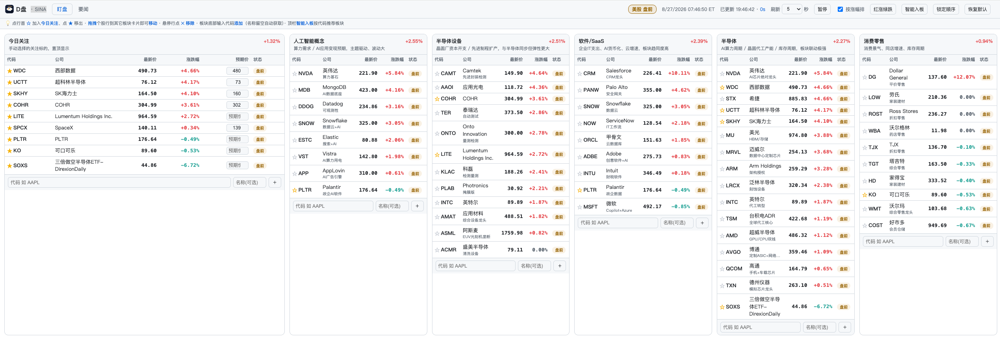

# US Stock Sector Watch Dashboard

<p align="center">
  
</p>

A single-page dashboard that tracks **15 hot US stock sectors** and their constituents, auto-refreshing prices every X seconds with **pre-market / regular / after-hours** sessions, plus aggregated financial news and price-alert notifications.

> [中文版本](./README.md)

<p align="center">
  
</p>

---

## Features

| Feature |
|---|
| 15 sectors × ~10 constituents, all on one page |
| Auto-refresh (5/10/15/30/60s, default 10s), pausable |
| Pre/regular/after-hours auto-switch; extended sessions show intraday change |
| Flash highlight on price movement & gain/loss color |
| US market status badge + Eastern Time |
| Red-up/green-down color convention switchable (remembered locally) |
| One-click sort by change % to spot leaders/laggards |
| Switchable sources: SINA / TENCENT / YAHOO / FUTU OpenAPI |
| Financial news aggregation page (flash + articles, fault-tolerant) |
| Price alerts: bidirectional target (lower/upper) + daily-drop, pushed to WeChat |
| Click a ticker to open its Yahoo Finance page |

---

## Quick Start

```bash
cd us_stock_dashboard
chmod +x run.sh
./run.sh
```

Open <http://localhost:8050> in your browser.

> Default port 8050 (avoids 5000, already taken by an A-share `stock_monitor` and macOS AirPlay).
> Dependencies: Flask, requests, feedparser. `run.sh` creates a virtualenv and installs them on first run.

Manual start:

```bash
python3 -m venv venv && source venv/bin/activate
pip install -r requirements.txt
python app.py
```

Run the tests (pure logic + Flask test client, zero network access):

```bash
python -m pytest
```

---

## Using the Dashboard

### Header controls

| Control | What it does |
|---|---|
| Refresh interval (5/10/15/30/60 s) | How often quotes auto-refresh (remembered locally) |
| `暂停` / `继续` (Pause/Resume) | Pause or resume auto-refresh |
| `按涨幅排` (Sort by change %) | When checked, stocks & sectors sort by change % descending (on by default, remembered locally) |
| `红涨绿跌` / `绿涨红跌` | Toggle red-up/green-down vs green-up/red-down color convention (remembered locally) |
| `智能入板` (Smart add) | Enter a ticker and get a recommended sector to add it to in one click |
| `锁定顺序` (Lock order) | Lock sector order (stops auto re-sort by change %); with it on, **drag sector headers** to reorder manually |
| `恢复默认` (Reset) | Restore the default sectors/stocks from `sectors.py` (clears customizations) |
| `测试提醒` (Test alert) | Send a test WeChat notification to verify the alert channel |
| Status badge + ET clock | Market state (盘中/盘前/盘后/休市) + current Eastern Time |
| `已更新 HH:MM:SS · Ns` | Last refresh time + countdown to the next one |

### Sector cards

- **Add a stock**: type a ticker in the input at the bottom of a card (name auto-fetched if left blank), press Enter or click `＋`.
- **Move a stock**: **drag** the stock row onto another sector card.
- **Remove a stock**: hover the row, click `✕` on the right.
- **Sector order**: by default sectors auto-sort by average change %; click `锁定顺序` to drag sector headers manually. 「今日关注」always stays pinned on top.

### Stock row

- **Ticker column**: `☆/★` adds/removes the stock to/from 「今日关注」; clicking the ticker opens its Yahoo Finance page.
- **Price / change %**: flash-highlighted on change, colored by gain/loss.
- **Session badge**: `盘中` (regular) / `盘前` (pre) / `盘后` (after) / `休市` (closed); extended-session prices come from the corresponding session.

### 「今日关注」(Watch) board

- Click the `☆` on any row to add that stock to the watch board (single row, always pinned on top).
- **下限价 (Lower) / 上限价 (Upper)**: type a target in the inputs (auto-saved after a 0.4 s pause); the row turns green when the latest price hits below lower or above upper.
- Stocks with a target price are checked by a background thread for **price-touch alerts** (see below), pushed to WeChat.

---

## Data Sources

Set via `DATA_SOURCE` (default `SINA`).

### SINA (default)

`hq.sinajs.cn`, batched by `gb_`+ticker. **Directly accessible in China, no login, with independent pre/after-hours prices.** A few new/delisted stocks and some ADRs are not covered (e.g. ZEEKR, NKLA, SQ, IMBBY, KAVL); those rows show `--`.

### TENCENT

`qt.gtimg.cn`, batched by `us`+ticker. Direct access in China, no login, but **no independent pre/after-hours prices and no updates in extended sessions** — a backup only. `DATA_SOURCE=TENCENT`.

### YAHOO

Zero-config, no login, **with independent pre/after-hours prices and `marketState`**. Unofficial API, geo-blocked in some regions (e.g. mainland China, returns 403). Backend handles crumb refresh & retry. `DATA_SOURCE=YAHOO`.

### FUTU OpenAPI

Official real-time quotes. Requires `futu-api`, a running OpenD (default `127.0.0.1:11111`), and `export DATA_SOURCE=FUTU`. Free-tier quotes may be delayed 15 min. `FUTU_HOST` / `FUTU_PORT` can override.

---

## Financial News

The `/news` page aggregates financial & geopolitical news from multiple sources, each fetched independently with fault tolerance and TTL caching:

- **Direct (CN)**: Wallstreetcn (flash/features), Eastmoney flash, 36Kr (flash/articles), ITHome, Cointelegraph, Seeking Alpha
- **Overseas (proxy needed)**: Reuters, CNBC, WSJ, NYT, FT, Bloomberg, Nikkei Asia

Overseas sources are usually blocked on mainland China direct connections; they are fetched only when `HTTPS_PROXY`/`HTTP_PROXY` is set, otherwise only the source label is shown (marked "proxy needed"). Cache TTL is controlled by `NEWS_CACHE_TTL` (default 180s).

---

## Configuration (Environment Variables)

| Variable | Default | Description |
|---|---|---|
| `DATA_SOURCE` | `SINA` | `SINA` / `TENCENT` / `YAHOO` / `FUTU` |
| `HOST` | `127.0.0.1` | Listen address (loopback by default; set `0.0.0.0` for LAN access) |
| `PORT` | `8050` | Port |
| `ADMIN_TOKEN` | empty | When set, all write APIs (POST/DELETE) require an `X-Admin-Token` header |
| `DEFAULT_REFRESH_SEC` | `10` | Default refresh interval |
| `QUOTE_CACHE_TTL` | `3` | Server-side quote cache (s), coalesces fast polling |
| `YAHOO_BATCH_SIZE` | `50` | Yahoo batch size |
| `YAHOO_TIMEOUT` | `10` | Yahoo timeout (s) |
| `FUTU_HOST` / `FUTU_PORT` | `127.0.0.1` / `11111` | OpenD address |
| `ALERT_CHANNEL` | `pushplus` | Channel: `pushplus` / `wecom` / `serverchan` |
| `ALERT_CHECK_INTERVAL` | `10` | Alert check interval (s) |
| `ALERT_HYSTERESIS_PCT` | `1.0` | Hysteresis %: after firing, must recover beyond this band before re-arming (prevents spam near target) |
| `ALERT_DAILY_DROP_PCT` | `0` | Daily-drop alert threshold (%). Alerts once per symbol per day when intraday change ≤ -threshold; `0` disables |
| `ALERT_SESSION_ONLY` | `1` | Only alert during active sessions (pre/regular/after-hours); `0` also checks when market closed |
| `PUSHPLUS_TOKEN` | empty | PushPlus token (when `ALERT_CHANNEL=pushplus`) |
| `WECOM_WEBHOOK` | empty | WeCom bot webhook (when `ALERT_CHANNEL=wecom`) |
| `SERVERCHAN_SENDKEY` | empty | ServerChan sendkey (when `ALERT_CHANNEL=serverchan`) |
| `NEWS_CACHE_TTL` | `180` | News cache TTL (s) |
| `HTTPS_PROXY` / `HTTP_PROXY` | empty | Proxy for overseas news |

---

## API

| Method | Path | Description |
|---|---|---|
| `GET` | `/` | Dashboard page |
| `GET` | `/news` | News page |
| `GET` | `/api/sectors` | Sector structure |
| `GET` | `/api/quotes` | All quotes `{symbol: {...}}` |
| `GET` | `/api/news` | Aggregated news |
| `POST` | `/api/sectors/<key>/stocks` | Add stock `{symbol, name?}` |
| `POST` | `/api/stocks/move` | Move stock `{symbol, from, to}` |
| `DELETE` | `/api/sectors/<key>/stocks/<symbol>` | Remove stock |
| `POST` | `/api/watch/<symbol>` | Add to watch |
| `DELETE` | `/api/watch/<symbol>` | Remove from watch |
| `POST` | `/api/watch/<symbol>/expect` | Set lower/upper price `{expect?, upper?}` (legacy `{price}` still works as lower) |
| `GET` | `/api/alerts/history` | Recent alert history (reversed, max 50) |
| `POST` | `/api/alerts/test` | Send a test notification to verify channel & token config |
| `POST` | `/api/reset` | Reset to defaults |
| `GET` | `/api/health` | Health |

Quote fields: `price`(active-session price) `prev_close` `change` `change_pct` `regular_price` `regular_change_pct` `pre_price` `pre_change_pct` `post_price` `post_change_pct` `market_state`(PRE/REGULAR/POST/CLOSED/PREPRE) `currency` `last_updated` `source`.

---

## Price Alerts

For watched stocks with a target price (**lower** or **upper**), a WeChat notification is pushed when the latest price **crosses below the lower price** or **crosses above the upper price**. A separate **daily-drop** alert is also supported.

### Usage

1. **Configure one channel**:

   - PushPlus (default, free 200/day): `export PUSHPLUS_TOKEN="your-token"`
   - WeCom bot: `export ALERT_CHANNEL=wecom && export WECOM_WEBHOOK="https://qyapi.weixin.qq.com/cgi-bin/webhook/send?key=xxx"`
   - ServerChan (free 5/day): `export ALERT_CHANNEL=serverchan && export SERVERCHAN_SENDKEY="your-sendkey"`

   Channels and tokens can also go in `~/.config/wallhawk.env` (auto-loaded by `run.sh`).

2. **Set target on page**: open dashboard → "今日关注" → click ⭐ → fill target in the "下限价"/"上限价" fields (auto-saved on blur/pause).

3. **(Optional) Self-test**: the "测试提醒" button in the header sends a test notification to confirm delivery.

4. **Run and keep alive**: `./run.sh`; a background thread checks every 10s.

### Trigger Rules (Edge-Triggered + Hysteresis-Armed)

- **Cross below lower**: notifies **once** at the moment price crosses below (≤) the lower price; no repeat while it stays below.
- **Cross above upper**: notifies **once** at the moment price crosses above (≥) the upper price; no repeat while it stays above.
- **Hysteresis debounce**: after firing, the target disarms until price recovers beyond `lower×(1+hysteresis%)` (or retreats below `upper×(1-hysteresis%)`). Default 1% — prevents spam from churn near the target.
- **Startup catch-up**: if a stock is already below its lower price at startup and was never notified, one "already reached" notification is sent (missed-crossing protection), then never repeated.
- **Daily drop**: alerts once per symbol per calendar day when intraday change ≤ -`ALERT_DAILY_DROP_PCT` (off by default).
- **Session-aware**: by default only checks during active sessions (pre/regular/after-hours); set `ALERT_SESSION_ONLY=0` to also check when closed.
- Changing a target resets its tracking; lower and upper can coexist independently.
- A "今日关注" row is highlighted when the latest price hits the lower/upper level.

> Alerts run in a Flask background thread — **keep the server process running**; trigger history & state persist to `alert_state.json` (no repeats after restart, up to 50 history entries).

---

## Customization (In-Page Editing)

The page supports add/remove/move, persisted to `watchlist.json` (survives restart). This file is git-ignored; **on first run (or "恢复默认") it is auto-seeded from `sectors.py`**, so your personal watchlist is never exposed after forking.

- **Add**: Enter a ticker at the bottom of a card (name auto-fetched if blank), click `＋`.
- **Move**: Drag a row onto another sector card.
- **Remove**: Hover a row, click `✕`.
- **Reset**: The "恢复默认" button restores the initial sectors from `sectors.py`.

---

## File Structure

```
us_stock_dashboard/
├── sectors.py              # Default sector seeds
├── config.py               # Config (env vars)
├── datasource.py           # Data source abstraction: SINA / TENCENT / YAHOO / FUTU
├── news.py                 # News aggregation
├── app.py                  # Backend
├── price_alert.py          # Price alerts
├── utils/weichat_notify.py # WeChat notify (pushplus/wecom/serverchan)
├── templates/index.html    # Dashboard UI
├── templates/news.html     # News UI
├── requirements.txt
├── pytest.ini              # pytest config
├── tests/                  # Test suite (pure logic + API, no network)
├── run.sh / run.bat
├── LICENSE                 # MIT License
├── README.md
└── README_EN.md
```

> `watchlist.json` / `alert_state.json` are runtime-generated and not committed.

---

## Disclaimer

- Quotes and news are for reference only, **not investment advice**.
- **Write APIs listen on loopback by default** (`HOST=127.0.0.1`). For LAN/remote access, explicitly set `HOST=0.0.0.0` AND set `ADMIN_TOKEN`, otherwise anyone on the same network can add/remove your tickers, change target prices, or reset to defaults.
- The Yahoo endpoint is unofficial and may fail under rate limiting; Futu requires login & OpenD. On failure the page shows a hint and keeps the last cached data.
- Sector/hotness ordering is approximate (based on the Futu US framework) and changes with market rotation.

---

## License

[MIT License](./LICENSE) © 2026

Before publishing your fork, replace the copyright holder in `LICENSE` with your own name.
